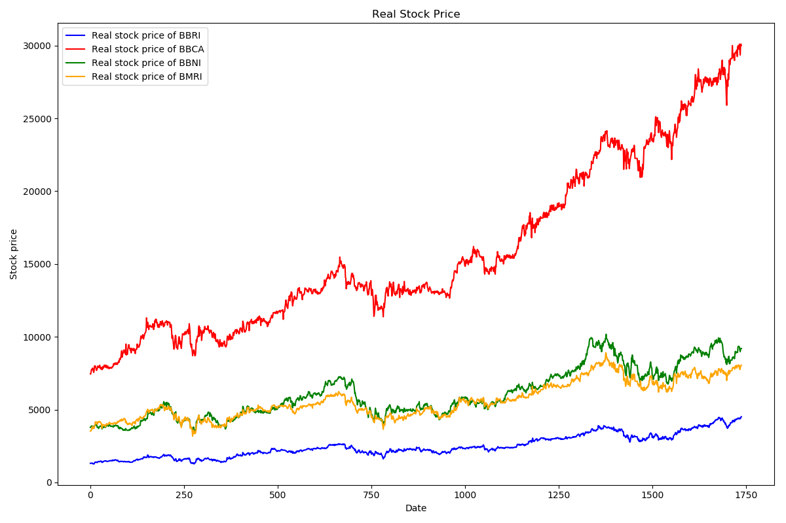
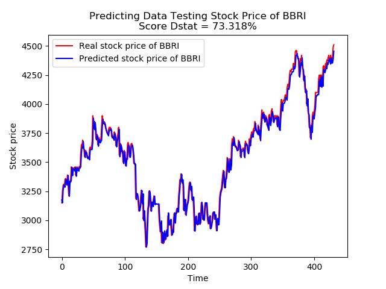
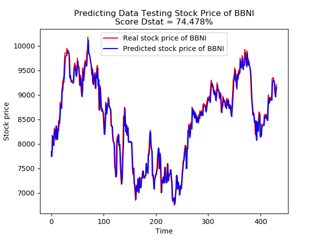
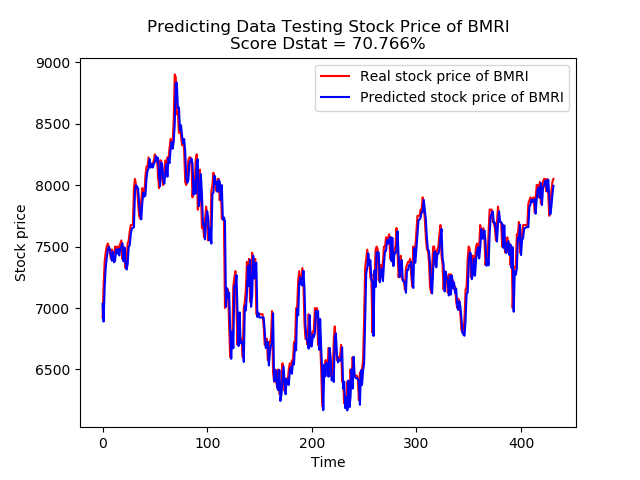
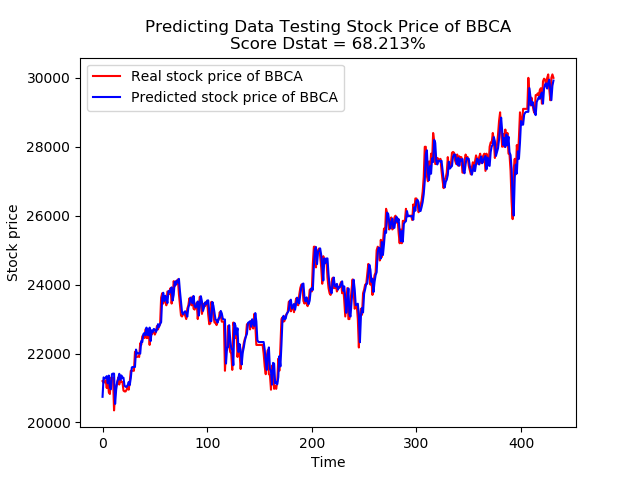

#  **Stock Price Prediction of Several Banks Using LSTM Recurrent Neural Network**

## **Dataset :**
The dataset is taken from **library yahoo_historical**. That consists of Open, High, Low, Closing and Volume of several banks (Bank BCA, Bank BRI, Bank BNI and Bank Mandiri) from **12th July 2012** until **12th July 2019** with total **1739 rows** in each stock. Variabel that used for prediction is Open Price.
```python
from yahoo_historical import Fetcher
namasaham = "bbca"
namasaham = namasaham.upper()
saham = Fetcher(namasaham+".JK", [2012,7,12], [2019,7,12], interval="1d")
saham = saham.getHistorical()
# Open Price
saham = saham.iloc[:,1:2]  
```


## **Data Pre-Processing :**
1. Remove rows with NA values in Open Price
    ```python
    saham = saham.dropna()  
    ``` 
2. Describe data

    * **BBCA**
    ```bash
           count          mean          std     min      25%      50%      75%      max
    Open  1739.0  15829.700978  5896.481231  7450.0  11025.0  13625.0  20887.5  30100.0
    ``` 
    * **BBRI**
    ```bash
           count         mean         std     min     25%     50%     75%     max
    Open  1739.0  2476.138585  778.166236  1270.0  1927.5  2300.0  3025.0  4510.0
    ```
    * **BBNI**
    ```bash
           count         mean         std     min     25%     50%     75%     max
    Open  1739.0  2476.138585  778.166236  1270.0  1927.5  2300.0  3025.0  4510.0
    ```

    * **BMRI**
    ```bash
           count         mean         std     min     25%     50%     75%     max
    Open  1739.0  2476.138585  778.166236  1270.0  1927.5  2300.0  3025.0  4510.0
    ```

3. Split dataset into data training and data testing with **train size=75%** and **test size=25 %**
    ```python
    percent_train = 0.75
    trainingset = saham.iloc[:int(len(saham)*percent_train),:]
    testset = saham.iloc[int(len(saham)*percent_train):,:]
    ``` 
4. Normalized data between zero and one with [MinMaxScaler](https://scikit-learn.org/stable/modules/generated/sklearn.preprocessing.MinMaxScaler.html)
    ```python
   from sklearn.preprocessing import MinMaxScaler

    sc = MinMaxScaler()
    trainingset = sc.fit_transform(trainingset)       
    testset = sc.fit_transform(testset)
    ```
5. Build trainX, trainY, testX and testY (with window = 3)
    ```python
    def createDataset(data, window):
        dataX, dataY = [], []
        for i in range(len(data)-window):
            temp = []
            for j in range(i, i+window):
                temp.append(data[j,0])
            dataX.append(temp)
            dataY.append(data[i+window,0])
        return np.array(dataX), np.array(dataY)   
    ```
## **Model :**
* Dropout = 0.2
* Epochs = 500
* LSTM 50
    ```python
    # Model Sequential
    regressor=Sequential()
    # Hidden layer (4)
    regressor.add(LSTM(units=50,activation='tanh',return_sequences=True, input_shape=(trainX.shape[1],1)))
    regressor.add(Dropout(0.2))

    regressor.add(LSTM(units=50, return_sequences=True))
    regressor.add(Dropout(0.2))

    regressor.add(LSTM(units=50, return_sequences=True))
    regressor.add(Dropout(0.2))

    regressor.add(LSTM(units=50))
    regressor.add(Dropout(0.2))

    # Output layer (1)
    regressor.add(Dense(units = 1))

    regressor.compile(optimizer='adam',loss='mean_squared_error')
    regressor.fit(trainX,trainY,epochs=500)
    ```
## **Predict data testing :**
```python
predict_price = regressor.predict(testX)
```
## **Denormalization data for accuration and plotting :**
```python
testY = sc.inverse_transform(testY.reshape(-1,1))
predict_price = sc.inverse_transform(predict_price)
trainingset = sc.inverse_transform(trainingset)
testset = sc.inverse_transform(testset)
```

## **Accuracy of model prediction :**
with Directional Statistics *(Dstat)* that more accurate
commonly used in special financial economic fields.

```python
def dstat(x,y):
    dstat = 0
    n = len(y)
    for i in range(n-1):
        if ((x[i+1]-y[i])*(y[i+1]-y[i]))>0 :
            dstat += 1
            Dstat = (float(1/(n-1))*dstat)*100
    return float(Dstat)
```

## **Ploting the result of data testing prediction :**
```python

# plot real data testing
plt.plot(np.arange(len(testY)),testY,color='red',label='Real stock price of {}'.format(namasaham))

# plot predict data testing
plt.plot(np.arange(len(predict_price)),predict_price,color='blue',label='Predicted stock price of {}'.format(namasaham))

plt.title('Predicting Data Testing Stock Price of {}\nScore Dstat ={}%'.format(namasaham,round(dstat(testY,predict_price),3)))
plt.xlabel('Time')
plt.ylabel('Stock price')
plt.legend()
plt.savefig('/templates/testing_predict_{}.png'.format(namasaham))
plt.show()
```






